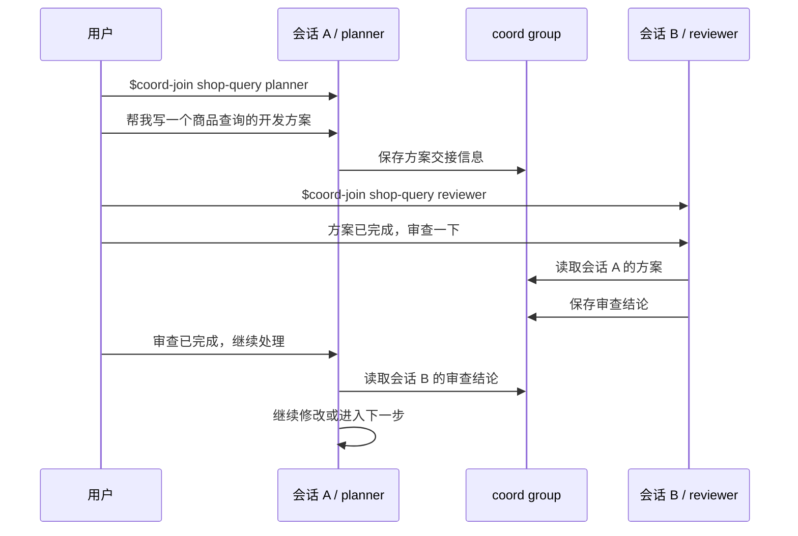

# Coord

Coord 用来让多个 AI 会话在本机共享协作状态。适合把同一个任务分给 planner、reviewer、executor 等不同会话，让它们通过同一个 group 交接结果。

不要把密钥、token 或隐私信息写进 coord。

## 环境检查

把本仓库下载到本地后，在终端进入仓库目录，执行：

```bash
python3 skills/coord/scripts/coord.py list groups
```

能正常输出 group 列表即可；没有 group 时输出 `(none)` 是正常的。这个检查只确认本仓库里的 Python helper 能运行。

## 如何安装

Codex：

```bash
./install.sh codex
```

默认安装到 `~/.agents/skills`。

Claude Code：

```bash
./install.sh claude
```

默认安装到 `~/.claude/skills`。

安装后重启对应 agent，让它重新发现 skills。

## 内置角色

- `planner`：整理需求、写方案、写 spec/plan。
- `reviewer`：审查方案、计划、代码和交付结果。
- `executor`：按明确任务或已审查计划执行实现。
- `stabilizer`：接手测试、复现、修 bug 和收尾。
- `frontend`：处理前端实现或审查。
- `backend`：处理后端实现或审查。

同一个 group 里，每个会话的 agent 名必须唯一。比如已经有一个 `executor`，第二个执行会话就用 `executor-2` 或 `executor_hotfix`；它们会按前缀继承 `executor` 的角色。

## 日常使用

`coord-join` 后面有两个参数：

- 第一个参数是 group 名：同一个任务用同一个 group。
- 第二个参数是 agent 名：当前会话在这个 group 里的角色名。

目标：会话 A 写方案，会话 B 审查方案，再让会话 A 根据审查结论继续。

会话 A 输入：

```text
$coord-join shop-query planner
```

然后继续给会话 A 输入：

```text
帮我写一个商品查询的开发方案
```

会话 B 输入：

```text
$coord-join shop-query reviewer
```

然后继续给会话 B 输入：

```text
方案已完成，审查一下
```

回到会话 A 输入：

```text
审查已完成，继续处理
```



## 高阶使用

输入 `$coord` 或查看对应 skill，探索 ask、answer、claim、release、status、archive 等高阶用法。
