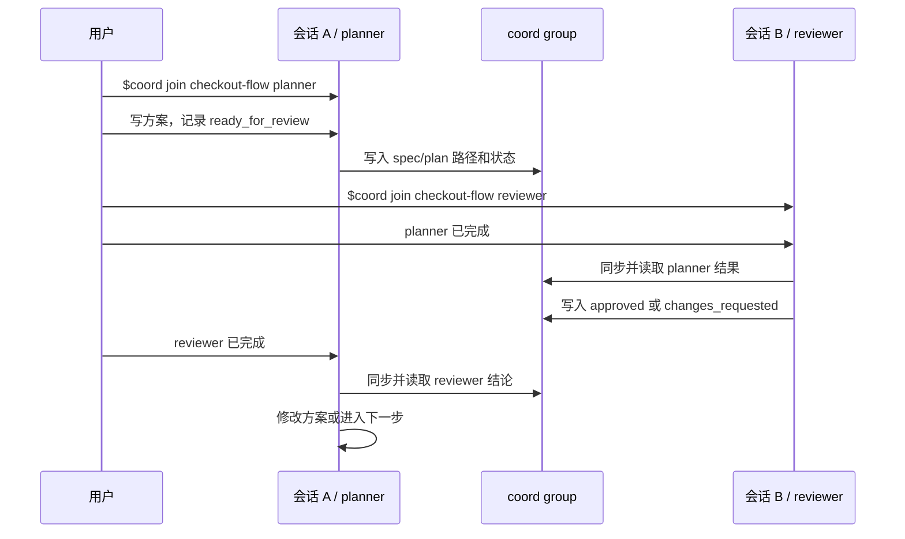

# Coord

Coord 用来让多个 AI 会话在本机共享协作状态。适合把同一个任务分给 planner、reviewer、executor 等不同会话，让它们通过同一个 group 交接结果。

不要把密钥、token 或隐私信息写进 coord。

## 环境检查

在仓库根目录执行：

```bash
python3 skills/coord/scripts/coord.py list groups
```

能正常输出 group 列表即可；没有 group 时输出 `(none)` 是正常的。

## 如何安装

Codex：

```bash
./install.sh codex
```

默认安装到 `~/.agents/skills`。

Claude Code：

```bash
./install.sh claude
```

默认安装到 `~/.claude/skills`。

安装后重启对应 agent，让它重新发现 skills。

## 内置角色

- `planner`：整理需求、写方案、写 spec/plan。
- `reviewer`：审查方案、计划、代码和交付结果。
- `executor`：按明确任务或已审查计划执行实现。
- `stabilizer`：接手测试、复现、修 bug 和收尾。
- `frontend`：处理前端实现或审查。
- `backend`：处理后端实现或审查。

同类多会话使用唯一名称，例如 `executor-2`、`reviewer_hotfix`、`planner-design`。

## 日常使用

目标：会话 A 写方案，会话 B 审查方案，再让会话 A 根据审查结论继续。

会话 A 输入：

```text
$coord join checkout-flow planner
```

然后继续给会话 A 输入：

```text
为 checkout-flow 写方案。完成后记录 spec/plan 路径，并把状态记为 ready_for_review。
```

会话 B 输入：

```text
$coord join checkout-flow reviewer
```

然后继续给会话 B 输入：

```text
planner 已完成。同步 coord，审查方案，记录 verdict=approved 或 changes_requested。
```

回到会话 A 输入：

```text
reviewer 已完成。同步 coord，根据 reviewer 结论修改方案或进入实现交接。
```



## 高阶使用

输入 `$coord` 或查看对应 skill，探索 ask、answer、claim、release、status、archive 等高阶用法。
